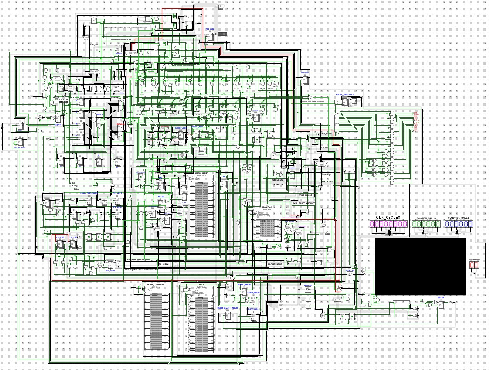

# 8-Bit Logisim CPU + Operating System

### Overview
---
The entire CPU was made in one `.circ` file. The CPU is 8 bits, with a 24-bit fixed instruction width and 10-bit addresses. In addition to 8 main registers and an ALU, the CPU offers the following features: 
- Data Stack
- Call Stack
- 1KB asynchronous RAM
- ROM loading to a fixed address
- Memory-mapped I/O
- User/Kernel Mode & Privilege Seperation (including `syscall`/`sysret`)

On the software side, this project includes a small monolithic kernel and a terminal program. This project also includes a CTF-style challenge, where one may attempt to display the flag string in the terminal.

For more information see the [documents folder](/docs), as everything is **extensively** documented there.
